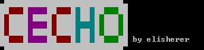

# cecho
colorful echo for windows

```
cecho v1.0 by elisherer

Displays messages, with colors by using escape codes.

Escape Codes:
    \## - # is an hex digit [0-F] representing a color, 1st is the backcolor
    \m - Reset color (not NULL)
    \n - Line-feed    \r - Carriage-return    \t - (Horizontal-) Tab
    \u#### - A unicode character. #### - the hexadecimal value.
    \U######## - A UTF32 character. ######## - the hexadecimal value.
    \x1b[##m - ANSI color syntax - ## as specified in the table below
    \x1b[0m - Reset color
    \" - The character "    \\ - The character \

* The values 0-F are used for foreground, for background add 10.
**The ^ sign escapes to insert other letters like & when not using parentheses.
```
Example:
```bat
@echo off
cecho "ÜŰŰŰŰŰŰŰŰŰŰŰŰŰŰŰŰŰŰŰŰŰŰŰŰŰÜ"
cecho "ŰŰ\40   \mŰ\50    \mŰŰ\40   \mŰ\30 \mŰŰ\30 \mŰŰ\20   \mŰŰ"
cecho "Ű\40 \mŰŰŰŰ\50 \mŰŰŰŰ\40 \mŰŰŰŰ\30 \mŰŰ\30 \mŰ\20 \mŰŰŰ\20 \mŰ"
cecho "Ű\40 \mŰŰŰŰ\50    \mŰ\40 \mŰŰŰŰ\30    \mŰ\20 \mŰŰŰ\20 \mŰ"
cecho "Ű\40 \mŰŰŰŰ\50 \mŰŰŰŰ\40 \mŰŰŰŰ\30 \mŰŰ\30 \mŰ\20 \mŰŰŰ\20 \mŰ"
cecho "ŰŰ\40   \mŰ\50    \mŰŰ\40   \mŰ\30 \mŰŰ\30 \mŰŰ\20   \mŰŰ by elisherer"
cecho "ßŰŰŰŰŰŰŰŰŰŰŰŰŰŰŰŰŰŰŰŰŰŰŰŰŰß"
```


